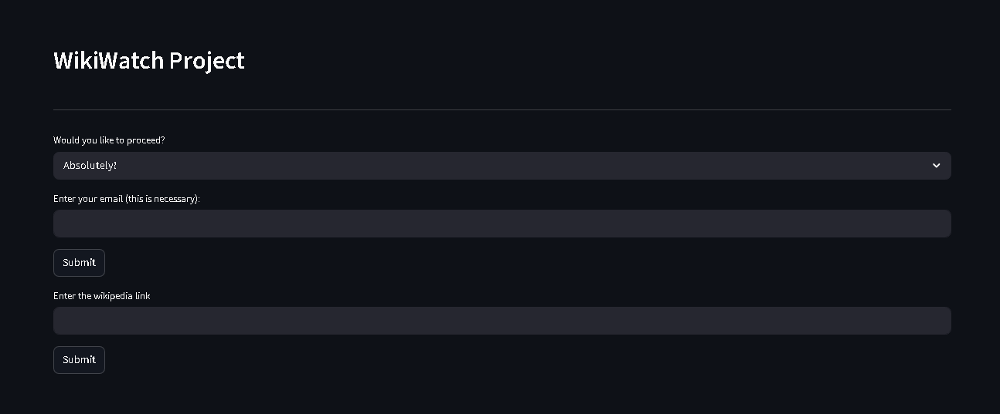

# WikiWatch

A Python Analysis tool that fetches data on a WikiPedia Article for better evaluation and insights of the page.

Project Link: https://en.wikipedia.org/wiki/Lelouch_Lamperouge
## Screenshots




## Run Locally

Clone the project

```bash
  git clone https://github.com/Muelvzz/WikiWatch
```

Go to the project directory

```bash
  cd backend
  cd app
```

Start the server

```bash
  streamlit run main.py
```


## FAQ

#### Why does the project requires an email to function?

When fetching article data on WikiPedia, it needs an email to verify who is accessing the data.

Throughout the development of this project, I have been using my personal email to access those API's and to my expereience, I haven't encountered any malicious activity from my emails. up to this point.

#### How does this work?

To put it simply. You will enter your email and then the wikipedia link that you want to evaluate - wait for a couple of seconds and it will present to you the data that it fetches such as:


1. The total number of words, characters, segments, links and unique links that the article has.
2. The recent edits that is conducted for the last 48 hours.
3. The total edits from an anonymous and registered users of the article.
4. The assessment on the article.

#### What's next on your project?

There are two routes that I would like to pursue for this project if this gets a lot of traction from you guys.

The first route is I want to expand this and turn into a website or an extension, while the second is an aim of exploring this analysis not just the WikiPedia but to also on other sites like Britannica.
## Lessons Learned

I have been building this project since the start of March, and what I've learned up to this point is really the importance of not overthinking the steps along the way.

So many times that I just spent so much time overthinking designs of the project where I should be focusing on shipping and deploying this as fast as possible.
## Feedback

If you have any feedback, please reach out to me at muelvinlopez25@gmail.com